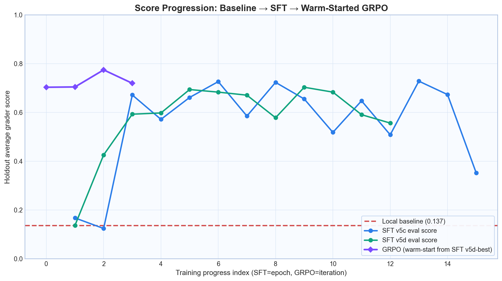
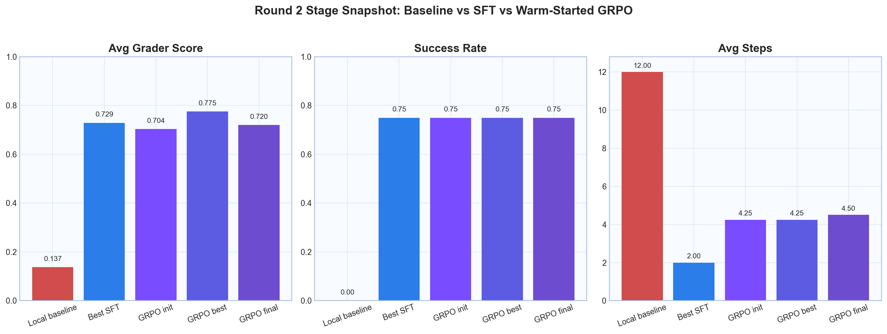
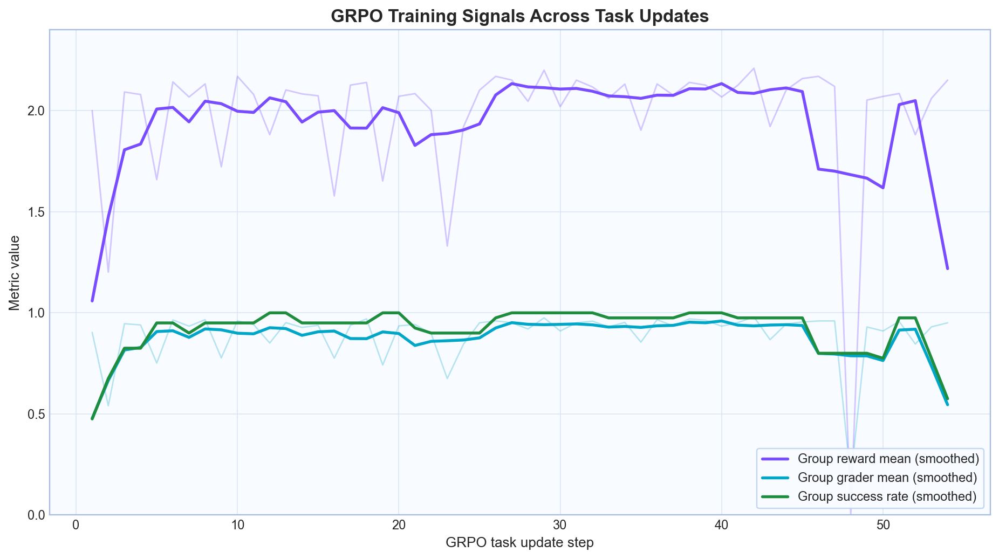
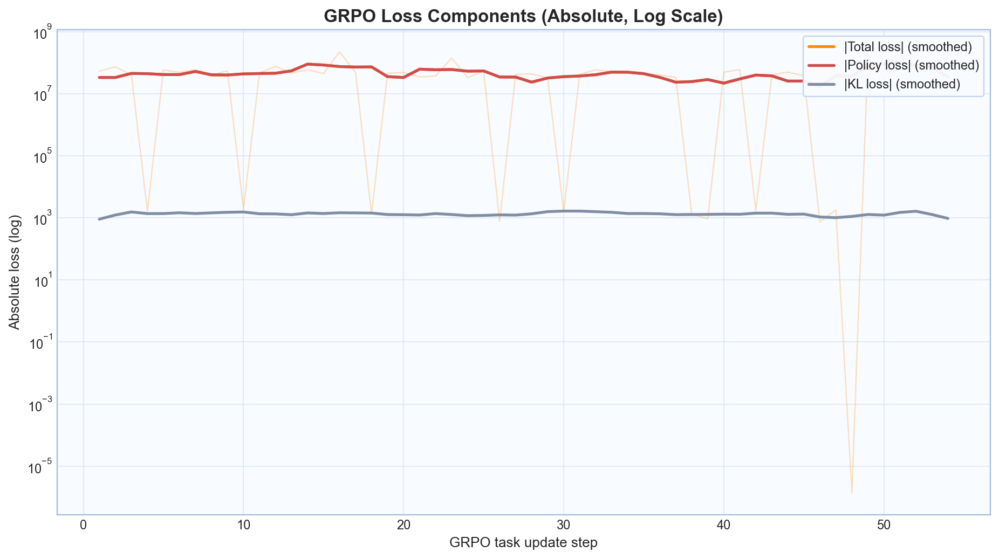
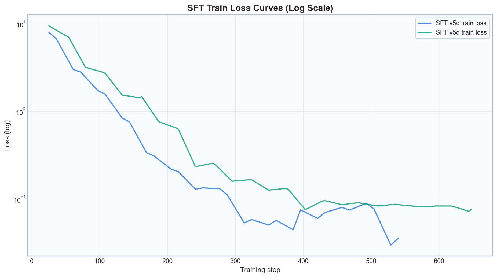

# InvoiceGuard: Teaching a 4B Model to Resolve Invoice Exceptions

Live demo webpage: [piyush-mk.github.io/InvoiceGuard](https://piyush-mk.github.io/InvoiceGuard/)

## The Problem

Three-way invoice matching is one of the most repetitive and error-prone workflows in enterprise finance. Teams have to compare invoices, purchase orders, and goods receipts, then make policy-compliant decisions quickly.

We built InvoiceGuard as an OpenEnv environment with 22 tasks, from simple clean matches to tricky fraud-like patterns such as split invoices and correction traps. The real challenge was not just formatting JSON actions. It was teaching an open-weight model to investigate, decide, and finish the episode with a correct final resolution.

## The Baseline Reality Check

At first glance, Qwen3-4B looked strong. Through Hugging Face Router it scored **0.83** on canonical tasks and **0.75** on hard tasks, close to GPT-4o on our benchmark slice.

But local training told a different story. When we loaded the same model under our training constraints (bf16, prompt limits, adapter flow), it collapsed to **0.137**. It could investigate well, but it almost never finished with `submit_final_resolution`.

That gave us the core goal for Round 2: close the gap between local untrained behavior and usable trained behavior.

## The First Wave of Failures

### Attempt 1: Full-Trace SFT in 4-bit

We started with the obvious recipe: expert traces with 9 investigation actions plus 1 submit action, then LoRA SFT on top.

Result: **0.155**, 0% success, almost no meaningful completion behavior.

Two root causes appeared quickly:
1. 4-bit quantization was harming decision quality even though we had enough VRAM.
2. The dataset was heavily imbalanced toward investigation actions, so the model learned to keep investigating forever.

### Attempt 2: Full-Trace SFT in bf16

We removed quantization, added variable trace lengths, and upweighted submit loss.

Result: still **0.155** and still 0% success.

This was the key lesson: if most gradients reward investigation patterns, the model keeps investigating even when it should conclude.

### Attempt 3: GRPO from Warmup

We then moved to GRPO expecting exploration to fix this.

Result: `group_reward_std=0.0` and effectively no learning signal because sampled trajectories were too similar.

So we paused and reframed the problem.

## The Breakthrough

We asked a simpler question: what if the model already knows how to investigate, and only lacks the skill of deciding when to submit?

That was exactly what the logs showed. The model could produce clean investigation actions, but it struggled to end the loop correctly.

So we switched to **submit-only SFT**.

### v5b: Submit-only on All Trace Lengths

We kept only submit examples (72 total) and trained for resolution behavior.

| Epoch | Score | Success Rate |
|-------|-------|-------------|
| 1 | **0.650** | 50% |
| 2 | 0.625 | 50% |
| 5 | 0.381 | 25% |
| 10 | 0.518 | 50% |

This was the first real jump, but the model sometimes submitted too early.

### v5c: Submit-only with Deep Context (min 7 investigation steps)

We filtered to submit examples that came after deeper investigation context.

| Epoch | Score | Success Rate | Avg Steps |
|-------|-------|-------------|-----------|
| 1 | 0.168 | 0% | 9.5 |
| 2 | 0.125 | 0% | 12.0 |
| 3 | 0.672 | 50% | 2.0 |
| **6** | **0.727** | **75%** | **3.0** |
| 8 | 0.724 | 75% | 3.0 |
| **13** | **0.729** | **75%** | **3.0** |

This is where things clicked. The model started investigating briefly and then submitting decisions that actually resolved tasks.

### v5d: Best-epoch checkpointing

Same core strategy, plus explicit best-checkpoint saving.

| Metric | Value |
|--------|-------|
| Best epoch | 9 |
| Best score | 0.704 |
| Success rate | 75% |
| Saved to | `piyush-mk/invoiceguard-qwen3-4b-sft-v5d-submit-deep-best` |

## Important Bugs We Fixed

1. **Missing EOS token during SFT completion training**  
   Without `<|im_end|>`, generation often continued past valid JSON and broke parsing.

2. **Qwen3 thinking blocks in output**  
   We disabled thinking mode and stripped residual blocks to protect token budget and parser stability.

3. **Fragile JSON extraction**  
   We added `_extract_first_json_object()` to safely parse the first valid JSON object.

4. **`n_pairs=0` style GRPO failure mode**  
   We made advantage handling robust even when variance is near zero.

5. **HF Jobs script argument limits**  
   We switched to running scripts by Hub URL to avoid command size issues.

## Final Numbers

| Configuration | Score | Success | vs Local Base |
|--------------|-------|---------|---------------|
| Local base (no training) | 0.137 | 0% | — |
| SFT v5c (best epoch) | 0.729 | 75% | **5.3× improvement** |
| SFT v5d (best checkpoint) | 0.704 | 75% | **5.1× improvement** |
| GRPO v6c (warm-start init) | 0.704 | 75% | **5.1× improvement** |
| GRPO v6c (best iter2) | 0.775 | 75% | **5.6× improvement** |
| GRPO v6c (final iter3) | 0.720 | 75% | **5.2× improvement** |
| API baseline (for reference) | 0.827 | — | — |

The trained model closes roughly 86% of the local-to-cloud gap:
`(0.729 - 0.137) / (0.827 - 0.137) = 85.8%`.

With warm-started GRPO, the best checkpoint closes about 92.5% of that gap:
`(0.775 - 0.137) / (0.827 - 0.137) = 92.5%`.

## Training Curves

### End to End Progression (Baseline → SFT → GRPO)

This view combines all stages into one timeline: local baseline at 0.137, SFT in the 0.70 range, then warm-started GRPO peaking at 0.775 before ending at 0.720.

### Stage Snapshot (Score, Success, Steps)

This summarizes where each stage lands on holdout tasks, including the fact that GRPO best is better than GRPO final.

### Eval Grader Score Over Epochs

Both v5c and v5d start near baseline and then jump sharply once submit behavior is learned. The fluctuations are expected with a compact dataset.

### Training Loss

Loss falls quickly from around 8 to below 0.1, indicating fast adaptation to the target behavior.

### Task Success Rate

Success rises from 0% to 50-75%, which is the strongest behavioral evidence that the model learned something real.

### Steps to Resolution

The untrained model times out at 12 steps. Trained models usually resolve in 3-5 steps after focused investigation.

### GRPO Training Signals

Reward and grader trends are strong overall, but we still see occasional instability pockets on specific tasks.

### GRPO Loss Components

Loss decomposition shows highly variable policy loss with relatively small KL loss, which explains why the best GRPO checkpoint appears before the final one.

### SFT Loss Curves (Log Scale)

Both submit-focused SFT runs converge quickly, which is exactly what we wanted before handing off to GRPO.

## Infrastructure and Artifacts

- **Training hardware:** Hugging Face Jobs, L40S GPU (48GB VRAM)
- **Run duration:** about 15 minutes for submit-only SFT (15 epochs x 36 examples)
- **Approx cost:** around $0.75 per successful run
- **Total runs:** 30+ across iterations
- **Hub artifacts:**
  - [piyush-mk/invoiceguard-qwen3-4b-sft-v5c-submit-deep](https://huggingface.co/piyush-mk/invoiceguard-qwen3-4b-sft-v5c-submit-deep) (best v5c adapter)
  - [piyush-mk/invoiceguard-qwen3-4b-sft-v5d-submit-deep-best](https://huggingface.co/piyush-mk/invoiceguard-qwen3-4b-sft-v5d-submit-deep-best) (best v5d checkpoint)
  - [piyush-mk/invoiceguard-code](https://huggingface.co/piyush-mk/invoiceguard-code) (training scripts)
- **Live demo webpage:** [piyush-mk.github.io/InvoiceGuard](https://piyush-mk.github.io/InvoiceGuard/)
- **Repo artifacts:** `invoice_guard/outputs/training_runs/` includes raw metrics JSONL, summaries, and curves
- **Baseline files:** `invoice_guard/outputs/baseline_scores/` includes local and API per-task evaluation traces
