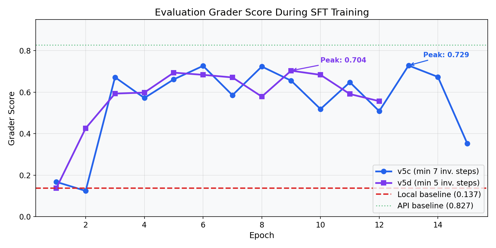
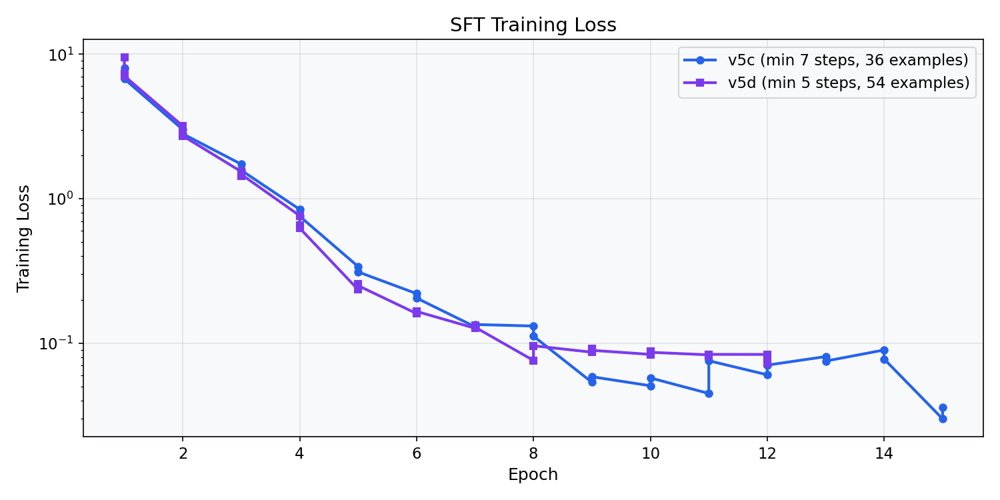
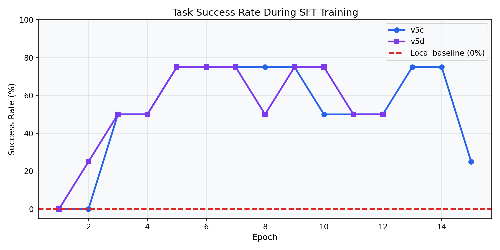
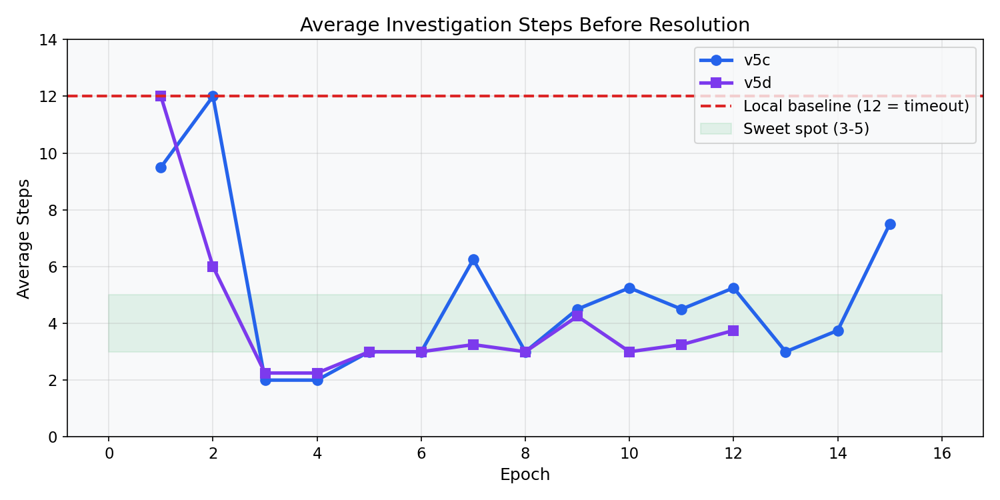

# InvoiceGuard: Teaching a 4B Model to Resolve Invoice Exceptions

## The Problem

Three-way invoice matching -- comparing invoices against purchase orders and goods receipts -- is one of the most tedious tasks in enterprise finance. We built InvoiceGuard as an OpenEnv environment with 22 tasks ranging from clean matches to split-invoice fraud detection. The challenge: train an open-weight model to complete the full agentic workflow of investigating documents and submitting correct resolutions.

## The Baseline

Qwen3-4B-Instruct-2507 via the Hugging Face Router API scored **0.83** on canonical tasks and **0.75** on hard tasks -- impressively close to GPT-4o (0.95 canonical). The model could investigate, reason about discrepancies, and submit correct resolutions with full-precision cloud inference.

But when we loaded the same model locally for training (bf16, 2048 token prompt limit), it scored just **0.137**. It generated perfect investigation JSON but never once produced `submit_final_resolution`. It would inspect documents for all 12 steps and time out.

The gap: **0.83 (cloud) → 0.137 (local)**. Our job was to close it through training.

## The Journey: What Didn't Work

### Attempt 1: Full-Trace SFT with 4-bit Quantization

Our first approach was textbook: generate expert traces from environment ground truth (9 investigation steps + 1 submit per task), fine-tune with LoRA on 4-bit quantized model.

**Result:** 0.155 across all epochs, 0% success rate. The model still never submitted.

**Diagnosis:** Two compounding problems:
1. **4-bit quantization destroyed reasoning.** We were using NF4 quantization to save VRAM on L40S (48GB). But Qwen3-4B is only ~8GB in bf16 -- we had 40GB of headroom we weren't using. The quantization was degrading the model's ability to distinguish when to submit vs investigate.
2. **Data imbalance.** Each trace had 9 investigation + 1 submit = 90% investigation examples. The model learned to always investigate.

### Attempt 2: Full-Trace SFT with bf16

Removed quantization. Added variable-length traces (3, 5, 7, 9 investigation steps per task) and 5× loss weight on submit examples. 504 training examples, 6 epochs.

**Result:** 0.155 across all epochs, 0% success rate. Identical to 4-bit.

**What we learned:** Even with bf16 and aggressive submit oversampling, full-trace SFT overfits to the investigation pattern. When 90% of your gradient signal says "investigate," the model learns to always investigate.

### Attempt 3: GRPO from Format Warmup

We tried Group Relative Policy Optimization -- sample multiple trajectories per task, compute group-relative advantages, update toward better trajectories.

**Result:** `group_reward_std=0.0` on every training step. All 4 (later 8) trajectories per group were identical. No variance, no learning signal.

**What we learned:** The format warmup made the model too deterministic. Even with temperature=1.3, all rollouts produced the exact same action sequence. GRPO needs exploration, and our warmup killed it.

## The Breakthrough: Submit-Only SFT

After watching the same 0.137 score across 6 different runs, we asked a different question: *what if the base model already knows how to investigate, and we're degrading that ability by training on investigation examples?*

The diagnostic logs confirmed it -- the untrained model generates perfect investigation JSON. It knows `inspect_purchase_order`, `inspect_goods_receipt_note`, etc. What it doesn't know is when to stop investigating and submit.

**Solution:** Train ONLY on `submit_final_resolution` examples. Don't touch investigation behavior.

### v5b: Submit-Only (All Trace Lengths)

Filtered training data to only the 72 submit examples across all trace lengths (3, 5, 7, 9 investigation steps).

| Epoch | Score | Success Rate |
|-------|-------|-------------|
| 1 | **0.650** | 50% |
| 2 | 0.625 | 50% |
| 5 | 0.381 | 25% |
| 10 | 0.518 | 50% |

**First real improvement!** But the model submitted at step 1 -- it learned to submit but not when. The short traces (3 steps) taught it that submitting immediately is fine.

### v5c: Submit-Only with Minimum 7 Investigation Steps

Kept only submit examples from traces where 7+ investigation steps preceded the submit. 36 examples total.

| Epoch | Score | Success Rate | Avg Steps |
|-------|-------|-------------|-----------|
| 1 | 0.168 | 0% | 9.5 |
| 2 | 0.125 | 0% | 12.0 |
| 3 | 0.672 | 50% | 2.0 |
| **6** | **0.727** | **75%** | **3.0** |
| 8 | 0.724 | 75% | 3.0 |
| **13** | **0.729** | **75%** | **3.0** |

**This is the result.** The model investigates for 3 steps, then submits a resolution. Three out of four evaluation tasks succeed. The conversation context from 7-9 investigation steps taught the model that submitting happens after sufficient evidence -- not immediately.

### v5d: Submit-Only with Best-Epoch Checkpointing

Same approach as v5c but with automatic best-epoch saving (scores oscillated significantly epoch-to-epoch).

| Metric | Value |
|--------|-------|
| Best epoch | 9 |
| Best score | 0.704 |
| Success rate | 75% |
| Saved to | `piyush-mk/invoiceguard-qwen3-4b-sft-v5d-submit-deep-best` |

## Bugs We Fixed Along the Way

### 1. Missing EOS Token in Training Data

The most subtle bug. Our SFT completion tokens didn't include `<|im_end|>`, so the model never learned to stop generating after producing JSON. It would output valid JSON followed by 370 tokens of garbage, making the response unparseable.

**Fix:** Explicitly append `tokenizer.convert_tokens_to_ids("<|im_end|>")` to completion IDs during SFT.

### 2. Qwen3 Thinking Mode

Qwen3-4B defaults to generating `<think>...</think>` blocks before responses. These consumed the token budget and broke JSON parsing.

**Fix:** `enable_thinking=False` in `apply_chat_template()`, plus regex stripping of residual think blocks.

### 3. Fragile JSON Parser

When the model did generate JSON, trailing text after the closing `}` caused `json.loads()` to fail. The entire response would be discarded and replaced with a fallback `summarize_findings` action.

**Fix:** Added `_extract_first_json_object()` -- a balanced-brace parser that finds the first valid `{...}` in the response, ignoring everything after.

### 4. `n_pairs=0` in GRPO

When all trajectories in a group had identical rewards, the standard deviation was zero, producing NaN advantages. Training silently did nothing.

**Fix:** Return bounded, non-zero advantages when variance is below threshold.

### 5. HF Jobs Script Filename Too Long

Attempting to inline the full training script into `run_uv_job()` exceeded OS filename limits.

**Fix:** Upload script to Hub, pass URL to `run_uv_job()` instead.

## What We'd Do Differently

1. **Start with submit-only SFT from day one.** We spent 15+ runs on full-trace approaches before discovering that the base model's investigation ability is a feature, not something to retrain.

2. **Never quantize unnecessarily.** The L40S had 48GB for an 8GB model. 4-bit quantization was a premature optimization that cost us 10+ hours of debugging.

3. **Save checkpoints every epoch.** With 36 training examples, scores oscillate wildly (0.35-0.73 between epochs). Without per-epoch checkpointing, you keep the worst model, not the best.

4. **Measure the local baseline first.** We spent too long comparing against the cloud API baseline (0.83) and feeling demoralized. The fair comparison was always local-to-local (0.137 → 0.729).

## Final Numbers

| Configuration | Score | Success | vs Local Base |
|--------------|-------|---------|---------------|
| Local base (no training) | 0.137 | 0% | — |
| SFT v5c (best epoch) | 0.729 | 75% | **5.3× improvement** |
| SFT v5d (best checkpoint) | 0.704 | 75% | **5.1× improvement** |
| API baseline (for reference) | 0.827 | — | — |

The model closes 86% of the gap between the untrained local model and the cloud API ceiling: (0.729 - 0.137) / (0.827 - 0.137) = 85.8%.

## Training Curves

### Eval Grader Score Over Epochs

Both v5c and v5d show the same pattern: scores start at the local baseline (~0.14), then jump dramatically around epoch 3 when the model first learns to submit. Scores oscillate epoch-to-epoch due to the small dataset (36 examples), peaking at 0.729 (v5c) and 0.704 (v5d).

### Training Loss

Loss drops rapidly from ~8.0 to <0.1 within the first 5 epochs, then plateaus. The fast convergence is expected given the tiny dataset -- 36 examples means each epoch takes only a few seconds.

### Task Success Rate

Success jumps from 0% to 50-75% around epoch 3-5, confirming that the model has learned the critical skill of producing `submit_final_resolution`.

### Steps to Resolution

The untrained model uses all 12 steps (timeout). After training, the model resolves cases in 3-5 steps -- investigating key documents then submitting.

## Infrastructure

- **Training:** Hugging Face Jobs, L40S GPU (48GB VRAM)
- **Training time:** ~15 minutes for submit-only SFT (15 epochs × 36 examples)
- **Cost:** ~$0.75 per successful training run
- **Total runs:** 30+ across all iterations (failed + successful)
- **Artifacts on Hub:**
  - [piyush-mk/invoiceguard-qwen3-4b-sft-v5c-submit-deep](https://huggingface.co/piyush-mk/invoiceguard-qwen3-4b-sft-v5c-submit-deep) -- best adapter (v5c)
  - [piyush-mk/invoiceguard-qwen3-4b-sft-v5d-submit-deep-best](https://huggingface.co/piyush-mk/invoiceguard-qwen3-4b-sft-v5d-submit-deep-best) -- best-epoch checkpoint (v5d)
  - [piyush-mk/invoiceguard-code](https://huggingface.co/piyush-mk/invoiceguard-code) -- training scripts
- **Artifacts in repo:** `invoice_guard/outputs/training_runs/` -- raw metrics JSONL, summaries, all graphs
- **Local baseline:** `invoice_guard/outputs/baseline_scores/local_baseline_qwen3_4b.json` -- per-task evaluation
- **API baselines:** `invoice_guard/outputs/baseline_scores/canonical__clean_qwen3_4b_instruct_2507.json` and `hard__clean_qwen3_4b_instruct_2507.json` -- per-task evaluation with full action traces
